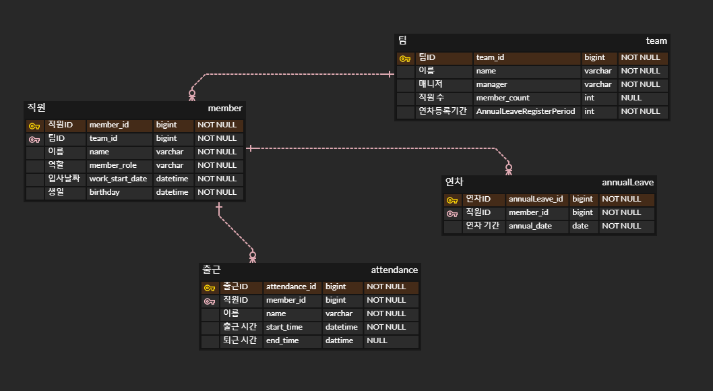

# 🏢 commuting-System

## ⚙ Tech Stack
</a>
</a>
 </a>

## 📰 ERD


## 🛠 프로그램 기능 및 설계
### 팀 관리
- 팀 등록 기능
  - 회사에 있는 팀을 등록할 수 있어야한다.
  - 팀이 가져야할 필수 정보는 `팀 이름`이다.

- 팀 조회 기능
  - 모든 팀의 정보를 한 번에 조회할 수 있어야한다.
```json
[
    {
      "name" : "팀 이름",
      "manager" : "팀 매니저 이름", //없을 경우 null 처리
      "memberCount" : "팀 인원 (숫자)"
    }
]
```

### 직원 관리
- 직원 등록 기능
    - 직원을 등록할 수 있어야한다.
    - `직원 이름`, `매니저 여부`, `회사 입사 날짜`, `생일` 을 등록한다.
- 직원 조회 기능
```json
[
    {
      "name" : "직원 이름",
      "teamName" : "소속팀 이름",
      "role" : "MANAGER or MEMBER", //매니저인지 직원인지?
      "birthday" : "1900-01-01",
      "workStartDate" : "2024-01-01"
    }
]
```

### 출퇴근 관리
- 출근 기능
  - 등록된 직원은 출근을 할 수 있다.
  - 출근한 직원이 또 다시 출근하려는 경우 예외 처리한다.
  - 출퇴근한 직원이 다시 출근하려는 경우 예외 처리한다.
  - 직원의 이름은 동명이인이 있을 수 있기에, DB에 저장된 `id`를 기준으로 처리된다.
- 퇴근 기능
  - 출근한 직원은 퇴근을 할 수 있다.
  - 퇴근하려던 직원이 출근하지 않은 경우 예외 처리한다.
  - 직원의 이름은 동명이인이 있을 수 있기에, DB에 저장된 `id`를 기준으로 처리된다.
- 특정 직원의 날짜별 근무시간 조회 기능
  - 특정 직원 `id`와 `2024-01`과 같이 연/월을 받으면, 날짜별 근무시간과 총합을 반환한다.
    - 이 때 근무 시간은 `분단위`로 계산된다.
  - ex) `1번` id의 직원이 `2024-01`을 기준으로 조회한다면 아래와 같이 응답이 반환된다.
  ```json
  {
    "detail": [
      {
        "date": "2024-01-01",
        "workingMinutes": 480,
        "usingDayOff": false  //연차를 사용하지 않으면 false
      },
      {
        "date": "2024-01-02",
        "workingMinutes": 0,
        "usingDayOff": true  //연차를 사용하면 true
      }
      // 2024.01.31일까지 존재할 수 있다.
    ],
    "sum": 10560
  }
  ```
  
### 연차 관리
- 연차 신청
  - 직원은 연차를 신청할 수 있다.
  - 연차는 무조건 하루 단위로만 사용이 가능하다.
  - 올해 입사한 직원은 11개의 연차, 그 외의 직원은 15개의 연차를 사용할 수 있다.
  - 연차를 사용하기 위해서는 연차 사용일을 기준으로 며칠 전에 `연차 등록`을 해야한다.
    - 연차를 등록하기만 하면, 매니저의 허가 없이 연차가 바로 적용된다.
    - 단, 팀마다 연차 등록 기간은 다르게 적용된다. (ex. A팀은 하루 전에 등록하면 연차 사용 가능, B팀은 7일전에 등록해야 사용 가능)
- 연차 조회
  - 직원의 `id`를 이용하여 올해 사용하지 않고 남은 연차를 확인할 수 있습니다.


## Reference
[인프런 워밍업 클럽 - 스터디 1기](https://www.inflearn.com/course/inflearn-warmup-club-study-1)
